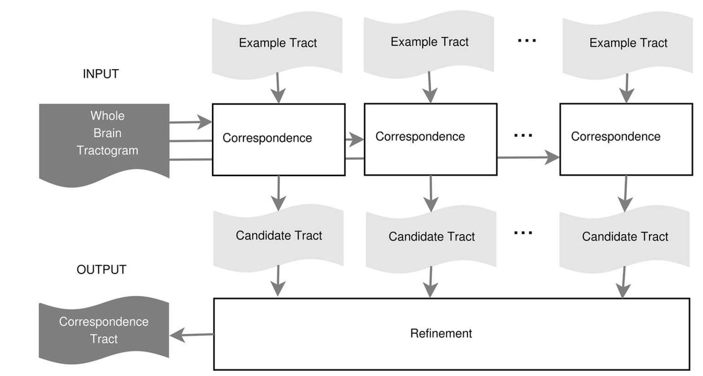

# app-multi-lap
This app segments white matter bundles by solving multiple Linear Assignment Problems (LAP or multi-LAP). The method is a supervised example-based segmentation method, and thus requires multiple bundles as examples to learn from. The segmentation is performed by means of fiber correspondence across subjects by considering the shape of the fibers (i.e. by computing fiber distances).

### Authors
- Giulia Bertò (giulia.berto.4@gmail.com)

### Contributors
- Emanuele Olivetti (olivetti@fbk.eu)

### Funding Acknowledgement
We kindly ask that you acknowledge the funding below in your publications and code reusing this code. \

### Citation
We kindly ask that you cite the following article when publishing papers and code using this code: \
["White Matter Tract Segmentation as Multiple Linear Assignment Problems"](https://doi.org/10.3389/fnins.2017.00754), Sharmin N., Olivetti E. and Avesani P. (2018) White Matter Tract Segmentation as Multiple Linear
Assignment Problems. Front. Neurosci. 11:754. doi: 10.3389/fnins.2017.00754

## Running the app
### On [Brainlife.io](http://brainlife.io/) 
You can submit this App online at https://doi.org/10.25663/brainlife.app.265 via the “Execute” tab.

Inputs:
To perform the bundle segmentation, you need two key elements: (i) the tractogram of the (target) subject you want to extract the bundle from and (ii) the wmc segmentations of multiple (example) subjects you want to learn from. Moreover, you have to provide the anatomical T1s and the tractograms of the (example) subjects (which are used to apply an initial Streamline Linear Registration (SLR) between tractograms).

Output:
You will get the wmc segmentation of the (single) bundle of interest in the target subject.

version 1.0: multi-LAP and multi-NN, wmc-deprecated input \
version 2.0: multi-LAP and multi-NN, trk input \
version 3.0: multi-LAP, new wmc input or trk input
